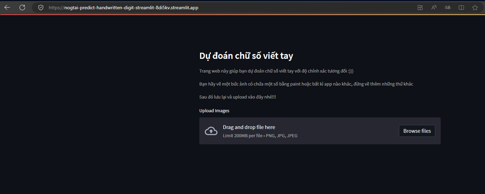

Để chạy được chương trình local trên thiết bị của bạn, trước tiên các bạn cần phải thiết đặt môi trường theo các bước sau:

B1: Cài đặt anaconda (https://docs.anaconda.com/anaconda/install/windows/)
B2: Sau khi đã cài đặt, các bạn mở anaconda powershell prompt
B3: Nhập lệnh: conda create -n tf2 python=3.6 để tạo môi trường mới
B4: conda deactivate 
B5: conda activate tf2 để vào môi trường tf2 vừa tạo
B6: Nhập lệnh: pip install tensorflow opencv-python pillow numpy matplotlib pywin32 tkinter để cài các thư viện cần thiết
B7: chuyển đến thư mục mà bạn đã tải về bằng lệnh cd "đường dẫn đến thư mục mà bạn đã tải về"
    VD: cd "C:\Users\theta\OneDrive - nogdev\Desktop\Work\Python\mnist\repo_mnist"
B8: Nhập lệnh: python.exe .\gui_digit_recognizer.py để chạy chương trình

Link demo: https://share.streamlit.io/nogtai/predict-handwritten-digit/streamlit.py
Website có thể bị dừng một thời gian sau khi khởi động nên bạn có thể liên hệ tôi để khởi động lại website demo

<<<<<<< HEAD

=======
>>>>>>> 9024752b277d68ac088eb81ff0dc9d2fe1de7839
